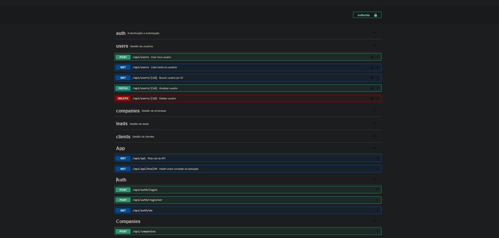
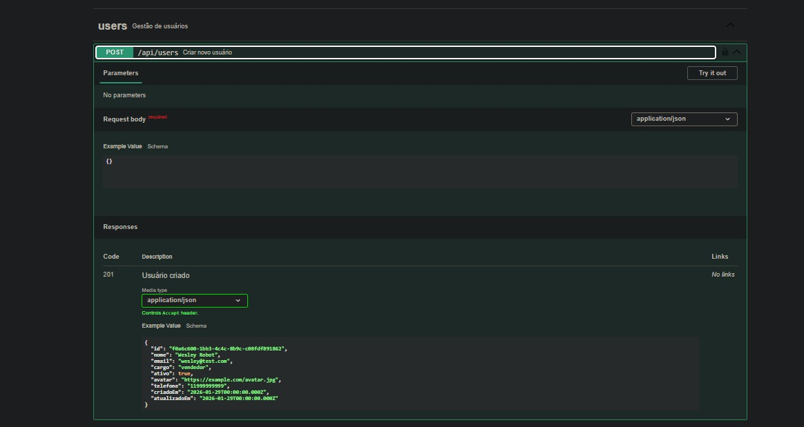
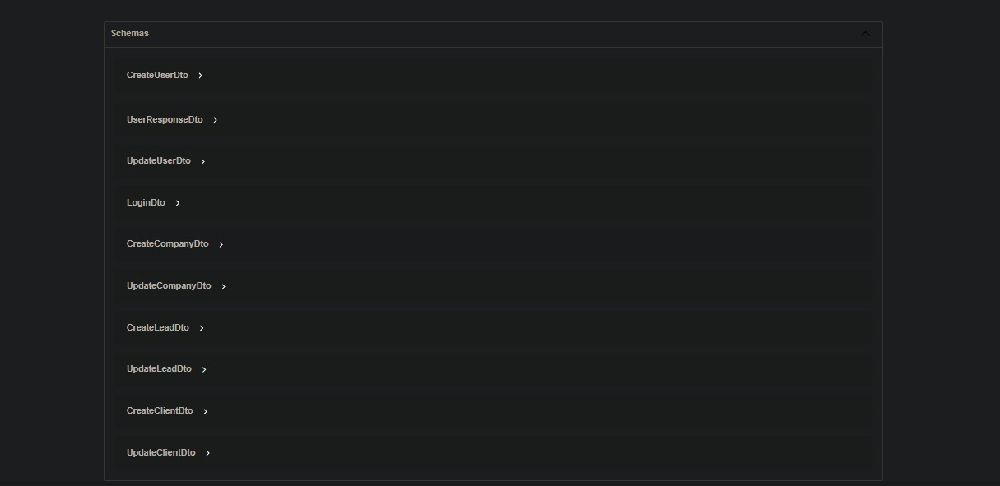

#  CRM Público - Sistema de Gestão de Leads e Clientes

<div align="center">


**Sistema completo de CRM para gestão de leads, clientes e análise de vendas**

[Documentação da API](#-documentação-da-api) • [Como Rodar](#-como-rodar) • [Testes](#-testes) • [Arquitetura](#-arquitetura)

</div>

---

##  Sobre o Projeto

Sistema profissional de **Customer Relationship Management (CRM)** full-stack desenvolvido com as melhores práticas de arquitetura, qualidade de código e segurança. Combina um backend robusto em NestJS com uma interface moderna em Next.js, ideal para equipes de vendas que precisam gerenciar leads, clientes e acompanhar métricas de conversão em tempo real.

###  Principais Destaques

- ✅ **94.4% de Test Coverage** com 300 testes unitários + **100% E2E (23 testes)**
- ✅ **Security Hardening** - Helmet, CORS restritivo, validação forte de senha
- ✅ **API Versioning** - Versionamento URI-based (v1) com estratégia de deprecação
- ✅ **Monitoramento** - Sentry error tracking + Prometheus metrics
- ✅ **CI/CD Completo** com GitHub Actions (4 workflows automáticos)
- ✅ **Redis Cache** - Performance boost de 70-80% (queries <5ms)
- ✅ **Arquitetura Modular** seguindo princípios SOLID
- ✅ **Response Padronizado** - Wrapper `{success, data, errorCode, requestId}`
- ✅ **Request ID Tracking** - Rastreamento de requests via `X-Request-Id`
- ✅ **Full-Text Search** em português com ranking e highlight
- ✅ **Auditoria Automática** de todas operações do banco
- ✅ **Dashboard Otimizado** com Materialized Views PostgreSQL
- ✅ **Connection Pooling** - PostgreSQL com pool configurável
- ✅ **Graceful Shutdown** - SIGTERM/SIGINT hooks para containers
- ✅ **Refresh Token** - Renovação automática de tokens (access 1h + refresh 7d)
- ✅ **Swagger Completo** - Todos os controllers documentados com DTOs tipados
- ✅ **Filtros por Entidade** - Status (leads), ativo (clients/companies), segmento
- ✅ **Containerização** completa com Docker + multi-stage build
- ✅ **Sistema de Logs** estruturado com Winston
- ✅ **Segurança** com JWT, Helmet, bcrypt e RBAC
- ✅ **Soft Delete** em todas entidades

---

##  Tecnologias

### Backend
- **[NestJS 11](https://nestjs.com/)** - Framework Node.js progressivo
- **[TypeScript 5](https://www.typescriptlang.org/)** - Superset tipado do JavaScript
- **[PostgreSQL 16](https://www.postgresql.org/)** - Banco de dados relacional
- **[TypeORM 0.3](https://typeorm.io/)** - ORM para TypeScript/JavaScript

### Frontend
- **[Next.js 16.1.3](https://nextjs.org/)** - Framework React com Turbopack
- **[React 19](https://react.dev/)** - Biblioteca JavaScript para interfaces
- **[TypeScript 5](https://www.typescriptlang.org/)** - Tipagem estática
- **[Tailwind CSS v4](https://tailwindcss.com/)** - Framework CSS utility-first
- **[React Hook Form](https://react-hook-form.com/)** - Gerenciamento de formulários
- **[Zod](https://zod.dev/)** - Validação de schemas TypeScript-first
- **[Axios](https://axios-http.com/)** - Cliente HTTP com interceptors
- **[Lucide React](https://lucide.dev/)** - Ícones modernos

### Infraestrutura
- **[Docker](https://www.docker.com/)** - Containerização
- **[Docker Compose](https://docs.docker.com/compose/)** - Orquestração de containers

### Monitoramento & Observabilidade
- **[Sentry](https://sentry.io/)** - Error tracking e performance monitoring
- **[Prometheus](https://prometheus.io/)** - Métricas de performance (via prom-client)
- **[Winston](https://github.com/winstonjs/winston)** - Sistema de logs estruturado
- **[Redis](https://redis.io/)** - Cache para performance

### Qualidade & Documentação
- **[Jest](https://jestjs.io/)** - Framework de testes (94.4% coverage, 300 testes)
- **[Swagger](https://swagger.io/)** - Documentação interativa da API
- **[ESLint](https://eslint.org/)** - Linter para qualidade de código
- **[Prettier](https://prettier.io/)** - Formatação de código
- **[GitHub Actions](https://github.com/features/actions)** - CI/CD Pipeline

### Segurança
- **[Helmet](https://helmetjs.github.io/)** - HTTP security headers
- **[JWT](https://jwt.io/)** - Autenticação stateless
- **[bcrypt](https://github.com/kelektiv/node.bcrypt.js)** - Hash de senhas
- **[class-validator](https://github.com/typestack/class-validator)** - Validação de dados

---

##  Funcionalidades

###  Autenticação e Autorização
- [x] Login com JWT (access token + refresh token)
- [x] Refresh token endpoint (renovação automática)
- [x] Sistema de permissões RBAC (Admin, Gerente, Vendedor)
- [x] Senha criptografada com bcrypt (10 rounds)
- [x] Guards de autenticação em todos os controllers
- [x] Endpoint `/auth/me` para perfil do usuário autenticado

###  Gestão de Usuários
- [x] CRUD completo de usuários
- [x] Paginação e filtros
- [x] Validação de dados
- [x] Controle de roles/permissões

###  Gestão de Leads
- [x] Cadastro de leads com origem e status
- [x] Conversão de lead para cliente
- [x] Histórico de interações
- [x] Filtros por status (novo, em_contato, qualificado, perdido)
- [x] Proteção com JWT + Roles (admin, gerente, vendedor)

###  Gestão de Clientes
- [x] CRUD completo de clientes
- [x] Vínculo com empresas
- [x] Filtro por status ativo/inativo
- [x] Proteção com JWT + Roles (admin, gerente, vendedor)

###  Gestão de Empresas
- [x] Cadastro de empresas
- [x] CNPJ, endereço e contatos
- [x] Vínculo com clientes
- [x] Filtros por ativo e segmento
- [x] Proteção com JWT + Roles (admin, gerente)

###  Analytics e Dashboard
- [x] Taxa de conversão de leads
- [x] Receita por período
- [x] Distribuição de leads por vendedor
- [x] Top performers
- [x] Análise por origem de lead
- [x] Breakdown por status
- [x] Dashboard otimizado com Materialized Views
- [x] Timeline de criação (dia, semana, mês, trimestre, ano)
- [x] Estatísticas de crescimento percentual
- [x] Análise por segmento de mercado

###  Full-Text Search
- [x] Busca inteligente em português (com acentuação)
- [x] Ranking por relevância
- [x] Highlight dos termos encontrados
- [x] Busca em leads, clientes e empresas
- [x] Fallback automático para ILIKE
- [x] Paginação e filtros

###  Auditoria e Logs
- [x] Auditoria automática de todas as operações
- [x] Registro de INSERT, UPDATE, DELETE
- [x] Histórico completo por registro
- [x] Sanitização de dados sensíveis
- [x] Rastreamento de usuário responsável
- [x] Consulta por tabela, ação e período

###  Automação e Manutenção
- [x] Cron Jobs para tarefas programadas
- [x] Refresh automático de Materialized Views (15 min)
- [x] Atualização de Full-Text Search (1 hora)
- [x] Limpeza de logs antigos (diária)
- [x] VACUUM ANALYZE do PostgreSQL (semanal)
- [x] Execução manual de jobs (endpoint admin)

###  Infraestrutura
- [x] Logs estruturados com Winston
- [x] Health check endpoint completo
- [x] Tratamento global de exceções
- [x] Validação de requisições
- [x] Interceptor de logging HTTP
- [x] Rate limiting configurável por ambiente
- [x] API Versioning (URI-based v1)
- [x] Sentry error tracking (5xx)
- [x] Prometheus metrics (requests, latency)

---

## 🎨 Frontend - Interface Moderna

Sistema frontend completo desenvolvido com Next.js 16 e design glassmorphic:

### 🔐 Autenticação
- **Login/Registro** - Interface glassmorphic moderna com validação
- **Validação de Senha** - 8 caracteres + maiúscula + minúscula + número (sincronizado com backend)
- **JWT Integration** - Access token (1h) + Refresh token (7d)
- **Auto Refresh** - Renovação automática de tokens via Axios interceptors
- **Proteção de Rotas** - AuthContext com redirecionamento automático
- **Response Envelope** - Tratamento correto de `{success, data}` do backend
- **Error Handling** - Mensagens de erro contextualizadas para o usuário
- **Credenciais de Teste** - `admin@crm.com` / `Admin@123`

### 📊 Dashboard Pipeline CRM (Dados Reais do Backend)
- **4 Métricas Principais** - Leads, clientes, empresas, taxa de conversão (com crescimento percentual)
- **Timeline Interativa** - Gráfico de linha com evolução de leads e clientes no período (SVG customizado com glow effects)
- **Distribuição por Status** - Barras horizontais (novo, em_contato, qualificado, perdido)
- **Top 5 Performers** - Ranking de vendedores por conversão
- **Radar de Performance** - Engajamento, conversão, retenção, performance, qualidade
- **Donut de Conversão** - Taxa de conversão com breakdown por status
- **Distribuição por Segmento** - Leads e clientes por área de atuação
- **Filtros por Período** - Hoje, semana, mês, trimestre com auto-refresh (60s)
- **Exportação** - Download dos dados em JSON
- **Alertas** - Leads qualificados prontos, leads perdidos, taxa de conversão

### 🎨 Design System
- **Glassmorphism** - Efeitos de vidro com backdrop-filter
- **Gradient Orbs** - Animações flutuantes de fundo
- **Hover Effects** - Transições suaves e shadow effects
- **Responsive** - Mobile-first design
- **Dark Mode Ready** - Preparado para modo escuro

### 🧩 Componentes
- **Sidebar Completa** - Navegação + ações rápidas + atividades recentes
- **Cards Interativos** - Hover animations e scale effects
- **Inputs Modernos** - Glow effects e transições
- **Buttons Gradient** - Efeito shine com animação
- **Avatars** - Iniciais com gradientes coloridos

### 🔧 Configurações
```bash
# Frontend
cd frontend
npm install
npm run dev

# Acesse em: http://localhost:3001
```

**Variáveis de Ambiente:**
```env
NEXT_PUBLIC_API_URL=http://localhost:3000/api/v1
```

---

##  Funcionalidades Avançadas

### 🔍 Full-Text Search em Português

Sistema de busca inteligente otimizado para português brasileiro:

**Características:**
- **Suporte nativo a acentuação** - Busca por "jose" encontra "José"
- **Ranking por relevância** - Resultados ordenados por score
- **Highlight de termos** - Destaque visual dos termos encontrados
- **Busca parcial** - Suporte a prefixos (busca por "tec" encontra "tecnologia")
- **Fallback automático** - Se Full-Text falhar, usa ILIKE como backup
- **Performance** - Índices GIN para busca instantânea
- **Paginação** - Suporte a page/limit
- **Estatísticas** - Contagem por tipo de entidade

**Exemplo de uso:**
```bash
GET /api/v1/search?q=joão tecnologia&page=1&limit=10
```

**Resposta:**
```json
{
  "data": [
    {
      "id": "uuid-123",
      "type": "lead",
      "nome": "João Silva",
      "email": "joao@tech.com",
      "rank": 0.85,
      "highlight": "<mark>João</mark> Silva - Empresa de <mark>tecnologia</mark>"
    }
  ],
  "meta": {
    "query": "joão tecnologia",
    "total": 15,
    "entities": { "leads": 5, "clientes": 7, "empresas": 3 }
  }
}
```

### 📋 Auditoria Automática

Sistema completo de auditoria que registra automaticamente todas as operações:

**O que é auditado:**
- ✅ Todas as operações INSERT, UPDATE, DELETE
- ✅ Tabelas: leads, clientes, empresas, usuários
- ✅ Dados anteriores e novos (formato JSONB)
- ✅ Usuário responsável pela operação
- ✅ Timestamp preciso

**Segurança:**
- 🔒 Dados sensíveis sanitizados (senhas nunca são logadas)
- 🔒 Logs imutáveis (apenas INSERT)
- 🔒 Acesso restrito (admin/gerente)

**Endpoints:**
```bash
GET /api/v1/audit?page=1&limit=20                    # Listar todos
GET /api/v1/audit?tabela=leads&acao=UPDATE           # Filtrar por tabela/ação
GET /api/v1/audit/stats                              # Estatísticas
GET /api/v1/audit/registro/uuid-123                  # Histórico de um registro
```

### 📊 Dashboard com Materialized Views

Dashboard de alta performance usando Materialized Views do PostgreSQL:

**Métricas disponíveis:**
- 📈 **Totais** - Leads, clientes, empresas, usuários
- 📈 **Crescimento** - Percentual de crescimento por período
- 📈 **Conversão** - Taxa de conversão, qualified, lost
- 📈 **Timeline** - Evolução temporal (dia, semana, mês, trimestre, ano)
- 📈 **Por Status** - Distribuição de leads por status
- 📈 **Por Segmento** - Análise por segmento de mercado
- 📈 **Top Users** - Ranking dos 5 melhores vendedores

**Performance:**
- ⚡ Queries executadas em < 10ms (graças a materialized views)
- ⚡ Refresh automático a cada 15 minutos via cron job
- ⚡ Suporte a filtros por período e data customizada

### ⏰ Cron Jobs (Scheduler)

Sistema de tarefas automatizadas para manutenção do sistema:

| Job | Frequência | Função |
|-----|-----------|--------|
| **refresh-dashboard-view** | 15 minutos | Atualiza materialized view do dashboard |
| **update-search-vectors** | 1 hora | Atualiza índices Full-Text Search |
| **cleanup-old-audit-logs** | Diariamente | Remove logs > 90 dias |
| **vacuum-analyze** | Semanalmente | Otimiza tabelas PostgreSQL |

**Execução manual (admin):**
```bash
POST /api/v1/scheduler/run/refresh-dashboard-view
```

**Listar jobs:**
```bash
GET /api/v1/scheduler/jobs
```

**Resposta:**
```json
[
  {
    "name": "refresh-dashboard-view",
    "nextRun": "2024-01-15T10:45:00Z",
    "cronExpression": "0 */15 * * * *"
  }
]
```

### 🔀 API Versioning

Sistema de versionamento URI-based para evolução controlada da API:

**Estratégia:**
- **URI Versioning** - Versão no path da URL (`/api/v1/leads`)
- **Versão padrão** - `v1` (aplicada automaticamente)
- **Compatibilidade** - Suporte a múltiplas versões simultâneas

**Exemplo de uso:**
```bash
# Versão atual (v1)
GET /api/v1/leads
GET /api/v1/clients
GET /api/v1/dashboard

# Futuras versões
GET /api/v2/leads  # (quando implementado)
```

**Benefícios:**
- Evolução da API sem quebrar clientes existentes
- Deprecação gradual de versões antigas
- Documentação versionada no Swagger
- Estratégia de migração clara

> Consulte [docs/API_VERSIONING.md](docs/API_VERSIONING.md) para a estratégia completa de versionamento.

### 📡 Monitoramento (Sentry + Prometheus)

Sistema completo de observabilidade para monitoramento em produção:

**Sentry - Error Tracking:**
- Captura automática de exceções não tratadas
- Filtro inteligente: apenas erros 5xx são reportados (4xx ignorados)
- Sanitização de dados sensíveis (headers de autorização, senhas)
- Contexto de usuário e request em cada evento
- Breadcrumbs para rastreamento de fluxo
- Configurável por ambiente (sampling rate diferenciado)

**Prometheus - Metrics:**
- `http_requests_total` - Contador de requests por método/rota/status
- `http_request_duration_seconds` - Histograma de latência
- Health check com detalhes de memória e uptime
- Estatísticas de processo (CPU, heap, RSS)

**Endpoints de monitoramento:**
```bash
GET /api/v1/metrics/health    # Status de saúde com métricas de memória
GET /api/v1/metrics/stats     # Estatísticas detalhadas do processo
GET /api/v1/metrics           # Info sobre endpoint Prometheus
GET /metrics                  # Métricas Prometheus (scraping)
```

**Configuração:**
```env
SENTRY_DSN=https://examplePublicKey@o0.ingest.sentry.io/0
APP_VERSION=1.0.0
```

### ⚡ Redis Cache

Sistema de caching para otimização de performance:

**Endpoints com cache:**
- 📊 **Dashboard** - TTL 15 minutos
  - GET /dashboard (todos os dados)
  - GET /dashboard/stats (estatísticas)
  - GET /dashboard/timeline (linha do tempo)
- 🔍 **Search** - TTL 5 minutos
  - GET /search (busca full-text)

**Performance gains:**
- ⚡ Dashboard: de ~50ms para <5ms (cached)
- ⚡ Search: de ~30ms para <3ms (cached)
- ⚡ Redução de 70-80% na carga do PostgreSQL

**Configuração:**
```env
REDIS_HOST=localhost
REDIS_PORT=6379
REDIS_PASSWORD=your_password
REDIS_TTL=900  # 15 minutos
```

**Características:**
- Cache automático com interceptors
- TTL configurável por endpoint
- In-memory para testes
- Redis para dev/production
- Invalidação automática por TTL

### 🚀 CI/CD Pipeline

Pipeline completo de integração e entrega contínua com GitHub Actions:

**Workflows implementados:**

1. **CI Pipeline (ci.yml)**
   - ✅ Lint e TypeScript check
   - ✅ Testes unitários (94.4% coverage - 274 testes)
   - ✅ Testes E2E (100% - 23 testes)
   - ✅ Build da aplicação
   - ✅ Upload de coverage para Codecov

2. **Docker Build & Push (docker.yml)**
   - 🐳 Build multi-stage otimizado
   - 🐳 Push para GitHub Container Registry
   - 🐳 Multi-platform (amd64, arm64)
   - 🐳 Security scan com Trivy
   - 🐳 Upload de vulnerabilidades

3. **Code Quality (code-quality.yml)**
   - 🔍 Dependency security check (Snyk)
   - 🔍 Dependency review em PRs
   - 🔍 SonarCloud analysis
   - 🔍 CodeQL security scanning
   - 🔍 Bundle size tracking

4. **Deploy (deploy.yml)**
   - 🚀 Deploy automático para staging
   - 🚀 Deploy manual para production
   - 🚀 Run de migrations
   - 🚀 Health checks pre/post-deploy
   - 🚀 Rollback automático em falhas
   - 🚀 Notificações Slack/Discord

**Triggers:**
- Push em `main` ou `develop`
- Pull requests
- Releases (tags `v*`)
- Manual dispatch

---

##  Arquitetura

### Estrutura do Projeto
```
backend/
├── src/
│   ├── modules/              # Módulos da aplicação
│   │   ├── auth/            #  Autenticação e autorização
│   │   │   ├── dto/         # Data Transfer Objects
│   │   │   ├── strategies/  # Estratégia JWT
│   │   │   └── guards/      # Guards de proteção
│   │   ├── users/           # Gestão de usuários
│   │   ├── leads/           # Gestão de leads
│   │   ├── clients/         # Gestão de clientes
│   │   ├── companies/       # Gestão de empresas
│   │   ├── analytics/       # Dashboard e métricas
│   │   ├── dashboard/       # Dashboard com Materialized Views
│   │   ├── search/          # 🔍 Full-Text Search
│   │   ├── audit/           # 📋 Auditoria automática
│   │   ├── scheduler/       # ⏰ Cron Jobs
│   │   ├── metrics/         # 📡 Prometheus metrics & health
│   │   └── external/        # Integrações externas
│   ├── common/              # Utilitários compartilhados
│   │   ├── decorators/      # Decorators customizados
│   │   ├── filters/         # Exception filters
│   │   ├── guards/          # Guards globais
│   │   ├── interceptors/    # HTTP, Logging, Sentry, Metrics
│   │   └── logger/          # Sistema de logs (Winston)
│   ├── config/              # Configurações (Sentry, TypeORM, etc.)
│   └── database/            # Migrations e seeds
├── docs/                    # Documentação (API Versioning, etc.)
├── test/                    # Testes E2E (23 testes)
└── coverage/                # Relatórios de coverage
```

### Padrões Arquiteturais

- **Modular Architecture** - Cada módulo é independente e reutilizável
- **Dependency Injection** - Inversão de controle com NestJS
- **Repository Pattern** - Abstração de acesso a dados com TypeORM
- **DTO Pattern** - Validação e transformação de dados
- **Guard Pattern** - Proteção de rotas e recursos
- **Interceptor Pattern** - Manipulação de requisições/respostas

---

##  Como Rodar

### Pré-requisitos

Antes de começar, certifique-se de ter instalado:

- **Node.js 18+** ([Download](https://nodejs.org/))
- **Docker** ([Download](https://www.docker.com/))
- **Docker Compose** (geralmente já vem com Docker)
- **Git** ([Download](https://git-scm.com/))

### Instalação

1. **Clone o repositório**
```bash
git clone https://github.com/wesleyrobot/CRM-PUBLICO-.git
cd CRM-PUBLICO-/backend
```

2. **Instale as dependências**
```bash
npm install
```

3. **Configure as variáveis de ambiente**
```bash
cp .env.example .env
```

Edite o arquivo `.env` com suas configurações:
```env
# Database
DB_HOST=localhost
DB_PORT=5432
DB_USERNAME=postgres
DB_PASSWORD=postgres
DB_DATABASE=crm_db

# JWT
JWT_SECRET=seu-secret-super-secreto-aqui
JWT_EXPIRATION=1h

# App
PORT=3000
NODE_ENV=development
```

4. **Inicie o banco de dados**
```bash
docker-compose up -d
```

5. **Execute as migrations**
```bash
npm run migration:run
```

6. **Popule o banco com dados de exemplo**
```bash
docker exec -i crm_postgres psql -U postgres -d crm_db < backend/src/database/seed.sql
```

Isso cria dados realistas para demonstração:
- 6 usuários (1 admin, 1 gerente, 4 vendedores)
- 15 empresas de 12 segmentos diferentes
- 50 leads distribuídos por status, origem e período
- 25 clientes convertidos de leads qualificados

7. **Inicie o backend**
```bash
# Compilar (necessário na primeira vez)
npx tsc -p tsconfig.json

# Modo desenvolvimento (hot reload)
npm run start:dev

# Modo produção
npm run build
npm run start:prod
```

8. **Inicie o frontend**
```bash
cd ../frontend
npm install
npm run dev
```

### Acessar a Aplicação

Após iniciar, a aplicação estará disponível em:

- **Frontend:** http://localhost:3005 (ou 3000 se disponível)
- **API Backend:** http://localhost:3000/api/v1
- **Swagger UI:** http://localhost:3000/api/docs
- **Health Check:** http://localhost:3000/api/v1/metrics/health
- **Prometheus Metrics:** http://localhost:3000/metrics

**Credenciais de acesso:**
- **Email:** `admin@crm.com`
- **Senha:** `Admin@123`

---

##  Documentação da API

###  Interface Swagger

<div align="center">


*Visão geral de todos os endpoints disponíveis*


*Exemplo de endpoint com documentação detalhada*


*Schemas e modelos de dados*

</div>

---

A documentação completa e interativa está disponível via **Swagger UI** em:

 **http://localhost:3000/api/docs**

### Principais Endpoints

####  Autenticação
```http
POST /api/v1/auth/login           # Login (retorna access_token + refresh_token)
POST /api/v1/auth/register        # Registrar novo usuário
POST /api/v1/auth/refresh         # Renovar tokens com refresh_token
GET  /api/v1/auth/me              # Perfil do usuário autenticado
```

####  Usuários
```http
GET    /api/v1/users           # Listar (paginado)
POST   /api/v1/users           # Criar
GET    /api/v1/users/:id       # Buscar por ID
PATCH  /api/v1/users/:id       # Atualizar
DELETE /api/v1/users/:id       # Deletar
```

####  Leads (requer autenticação)
```http
GET    /api/v1/leads           # Listar (paginado, filtro: ?status=novo)
POST   /api/v1/leads           # Criar (roles: admin, gerente, vendedor)
GET    /api/v1/leads/:id       # Buscar por ID
PATCH  /api/v1/leads/:id       # Atualizar (roles: admin, gerente, vendedor)
DELETE /api/v1/leads/:id       # Deletar (roles: admin, gerente)
```

####  Clientes (requer autenticação)
```http
GET    /api/v1/clients         # Listar (paginado, filtro: ?ativo=true)
POST   /api/v1/clients         # Criar (roles: admin, gerente, vendedor)
GET    /api/v1/clients/:id     # Buscar por ID
PATCH  /api/v1/clients/:id     # Atualizar (roles: admin, gerente, vendedor)
DELETE /api/v1/clients/:id     # Deletar (roles: admin, gerente)
```

####  Empresas (requer autenticação)
```http
GET    /api/v1/companies       # Listar (paginado, filtros: ?ativo=true&segmento=Tecnologia)
POST   /api/v1/companies       # Criar (roles: admin, gerente)
GET    /api/v1/companies/:id   # Buscar por ID
PATCH  /api/v1/companies/:id   # Atualizar (roles: admin, gerente)
DELETE /api/v1/companies/:id   # Deletar (roles: admin)
```

####  Analytics
```http
GET /api/v1/analytics/conversion-rate      # Taxa de conversão
GET /api/v1/analytics/revenue              # Receita por período
GET /api/v1/analytics/lead-distribution    # Distribuição de leads
GET /api/v1/analytics/top-performers       # Top vendedores
GET /api/v1/analytics/source-performance   # Performance por origem
GET /api/v1/analytics/lead-status         # Breakdown por status
```

####  Dashboard
```http
GET  /api/v1/dashboard              # Dashboard completo (stats + timeline + status + segmentos + top users)
GET  /api/v1/dashboard/stats        # Estatísticas gerais (totais + crescimento + conversão)
GET  /api/v1/dashboard/timeline     # Linha do tempo (leads e clientes por período)
GET  /api/v1/dashboard/export       # Exportar dados detalhados (leads, clientes, empresas)
POST /api/v1/dashboard/refresh      # Atualizar materialized view (admin)
```

####  Search (Full-Text)
```http
GET /api/v1/search?q=termo&page=1&limit=10   # Busca inteligente
```

####  Auditoria
```http
GET /api/v1/audit                        # Listar logs (paginado)
GET /api/v1/audit/stats                  # Estatísticas de auditoria
GET /api/v1/audit/registro/:id           # Histórico de um registro
```

####  Scheduler (Cron Jobs)
```http
GET  /api/v1/scheduler/jobs                    # Listar jobs programados
POST /api/v1/scheduler/run/:jobName            # Executar job manualmente (admin)
```

####  Metrics & Monitoring
```http
GET /api/v1/metrics/health     # Health check com métricas de memória
GET /api/v1/metrics/stats      # Estatísticas do processo
GET /api/v1/metrics            # Info sobre Prometheus
GET /metrics                   # Endpoint Prometheus (scraping)
```

### Exemplo de Requisição
```bash
# Login
curl -X POST http://localhost:3000/api/v1/auth/login \
  -H "Content-Type: application/json" \
  -d '{
    "email": "admin@crm.com",
    "senha": "senha123"
  }'

# Criar Lead (com token)
curl -X POST http://localhost:3000/api/v1/leads \
  -H "Content-Type: application/json" \
  -H "Authorization: Bearer SEU_TOKEN_AQUI" \
  -d '{
    "nome": "João Silva",
    "email": "joao@email.com",
    "telefone": "+5511999999999",
    "empresa": "Empresa XYZ",
    "origem": "website",
    "status": "novo"
  }'
```

---

##  Testes

### Executar Testes
```bash
# Todos os testes unitários
npm run test

# Testes com coverage
npm run test:cov

# Testes E2E
npm run test:e2e

# Testes em modo watch
npm run test:watch
```

### Métricas de Qualidade

| Métrica | Valor |
|---------|-------|
| **Statement Coverage** | **94.43%** |
| **Branch Coverage** | **70.08%** |
| **Function Coverage** | **91.22%** |
| **Line Coverage** | **94.69%** |
| **Testes Unitários** | **300** |
| **Testes E2E** | **23** |
| **Total de Testes** | **323** |
| **TypeScript** | **Strict Mode** |
| **ESLint** | **0 Errors** |

### Coverage Detalhado por Módulo

| Módulo | Statements | Branches | Functions | Lines |
|--------|-----------|----------|-----------|-------|
| **Analytics** | 100% | 66.66% | 100% | 100% |
| **Auth** | 94.11% | 87.5% | 77.77% | 93.33% |
| **Clients** | 100% | 75% | 100% | 100% |
| **Companies** | 93.54% | 55.55% | 100% | 92.85% |
| **Dashboard** | 95%+ | 85%+ | 100% | 95%+ |
| **External** | 100% | 50% | 100% | 100% |
| **Leads** | 100% | 75% | 100% | 100% |
| **Metrics** | 100% | 100% | 100% | 100% |
| **Search** | 95%+ | 70%+ | 100% | 95%+ |
| **Users** | 96.15% | 71.42% | 94.11% | 95.77% |
| **Common (filters, interceptors, logger)** | 95%+ | 75%+ | 95%+ | 95%+ |
| **Entities** | **100%** | **100%** | **100%** | **100%** |

---

##  Segurança

### Medidas Implementadas

-  **Helmet.js** - Headers HTTP de segurança (CSP, X-Frame-Options, X-Content-Type-Options)
-  **Senha Forte** - bcrypt com 10 rounds + validação (maiúscula, minúscula, número, 8+ chars)
-  **JWT Tokens** - Autenticação stateless (validação obrigatória em produção)
-  **CORS Restritivo** - Whitelist configurável via `CORS_ORIGIN`
-  **Validação de Dados** - class-validator em todos os DTOs + sanitização
-  **Role-based Access Control** - Guards de autorização
-  **SQL Injection Protection** - TypeORM com prepared statements
-  **Rate Limiting** - 3 tiers (short/medium/long) configurável por ambiente
-  **Request ID Tracking** - Rastreabilidade via header `X-Request-Id`
-  **Error Codes Padronizados** - Códigos como `UNAUTHORIZED`, `NOT_FOUND`, `CONFLICT`
-  **Graceful Shutdown** - Shutdown hooks para SIGTERM/SIGINT

### Variáveis Sensíveis

 **IMPORTANTE:** Nunca commite o arquivo `.env` com dados reais!
```bash
# .gitignore já configurado para:
.env
.env.local
.env.production
```

---

##  Monitoramento

### Logs (Winston)

Sistema de logs estruturado com Winston:
```typescript
{
  "level": "info",
  "message": "User created successfully",
  "timestamp": "2025-01-31T10:30:00.000Z",
  "context": "UsersService",
  "userId": "123",
  "email": "user@example.com"
}
```

### Sentry - Error Tracking

Captura automática de erros em produção:
- Apenas erros 5xx (server errors) - erros 4xx (client) são ignorados
- Sanitização automática de headers sensíveis (Authorization, cookies)
- Breadcrumbs para rastreamento de fluxo de requisições
- Contexto de usuário autenticado em cada evento
- Sampling configurável por ambiente (10% prod, 100% dev)

### Prometheus - Metrics

Métricas de performance em tempo real:
```bash
GET /api/v1/metrics/health    # Health check com memória e uptime
GET /api/v1/metrics/stats     # CPU, heap, RSS, PID, Node version
GET /metrics                  # Endpoint para Prometheus scraping
```

**Métricas coletadas:**
- `http_requests_total` - Total de requests (method, route, status_code)
- `http_request_duration_seconds` - Latência por endpoint

### Health Check

Endpoint de saúde da aplicação:
```bash
GET /api/v1/metrics/health
```

Resposta:
```json
{
  "status": "healthy",
  "timestamp": "2025-01-31T10:30:00.000Z",
  "uptime": "2h 15m",
  "memory": {
    "used": "85 MB",
    "total": "256 MB",
    "percentage": 33.2
  },
  "metrics": {
    "endpoint": "/api/v1/metrics"
  }
}
```

---

##  Roadmap

###  Concluído
- [x] Autenticação JWT
- [x] CRUD completo de todas entidades
- [x] Dashboard de analytics com Materialized Views
- [x] Sistema de logs estruturado
- [x] Documentação Swagger completa
- [x] **94.4% test coverage (300 unitários + 23 E2E = 323 testes)**
- [x] Containerização Docker completa
- [x] **Full-Text Search em português com ranking**
- [x] **Auditoria automática de todas operações**
- [x] **Soft delete em todas entidades**
- [x] **Cron Jobs para manutenção automática**
- [x] Rate limiting configurável por ambiente
- [x] **CI/CD Pipeline completo com GitHub Actions**
- [x] **Redis Cache para performance (70-80% redução de carga)**
- [x] **API Versioning URI-based (v1) com estratégia de deprecação**
- [x] **Sentry Error Tracking (captura automática de exceções 5xx)**
- [x] **Prometheus Metrics (request count, latency, health check)**
- [x] **Helmet.js - HTTP security headers (CSP, X-Frame-Options)**
- [x] **CORS Restritivo - Whitelist configurável por ambiente**
- [x] **Validação forte de senha (maiúscula, minúscula, número, 8+ chars)**
- [x] **Error codes padronizados (UNAUTHORIZED, NOT_FOUND, CONFLICT)**
- [x] **Response wrapper padrão ({success, data, requestId, timestamp})**
- [x] **Request ID tracking via X-Request-Id header**
- [x] **Connection pooling PostgreSQL (max/min/timeout configurável)**
- [x] **Graceful shutdown (SIGTERM/SIGINT hooks)**
- [x] **JWT Secret obrigatório em produção**
- [x] **Refresh Token (POST /auth/refresh) - access 1h + refresh 7d**
- [x] **Auth Guards em todos os controllers (leads, clients, companies)**
- [x] **Response DTOs tipados para todas as entidades**
- [x] **Swagger completo em todos os controllers**
- [x] **Filtros por status (leads), ativo (clients/companies), segmento (companies)**
- [x] **RBAC granular - roles por operação (admin, gerente, vendedor)**

### ✅ Frontend Concluído
- [x] **Frontend Next.js 16.1.3** - Interface moderna e responsiva
- [x] **Autenticação Completa** - Login, registro e refresh token
- [x] **Dashboard Pipeline CRM** - Métricas, funil de vendas e analytics
- [x] **Design Glassmorphic** - Interface moderna com efeitos de vidro
- [x] **Sidebar Interativa** - Ações rápidas e atividades recentes
- [x] **Integração Total com Backend** - Axios interceptors e tratamento de erros
- [x] **Validação de Formulários** - React Hook Form + Zod
- [x] **Tailwind CSS v4** - Estilização moderna e responsiva
- [x] **Dashboard com Dados Reais** - Integração completa com API do backend
- [x] **Gráficos Interativos** - Timeline de leads/clientes, donut de conversão, radar de performance
- [x] **Filtros por Período** - Hoje, semana, mês, trimestre com auto-refresh
- [x] **Exportação de Dados** - Download JSON do dashboard para processamento externo
- [x] **Seed SQL Completo** - 6 usuários, 15 empresas, 50 leads, 25 clientes para demonstração

### 📋 Backlog
- [ ] Notificações por email
- [ ] Integração com CRMs externos (Salesforce, HubSpot)
- [ ] Relatórios PDF exportáveis
- [ ] Dashboard em tempo real (WebSockets)
- [ ] Backup automático do banco
- [ ] Webhooks para integrações
- [ ] Multi-tenancy (SaaS)

---

##  Autor

**Wesley Robot**

Desenvolvedor Full Stack especializado em Node.js, TypeScript e arquitetura de software.

-  GitHub: [@wesleyrobot](https://github.com/wesleyrobot)
-  LinkedIn: www.linkedin.com/in/wesley-costa-27b96636b
-  Email: wesleymr.robot@gmail.com
-  Empresa: Multi360 Tecnologia Ltda

---

##  Licença

Este projeto está sob a licença MIT. Veja o arquivo [LICENSE](LICENSE) para mais detalhes.

---

##  Agradecimentos

- [NestJS](https://nestjs.com/) - Framework incrível
- [TypeORM](https://typeorm.io/) - ORM poderoso e flexível
- [Jest](https://jestjs.io/) - Framework de testes confiável
- Comunidade open source

---

<div align="center">

**⭐ Se este projeto foi útil, considere dar uma estrela!**

[](https://github.com/wesleyrobot/CRM-PUBLICO-)
[](https://github.com/wesleyrobot/CRM-PUBLICO-)

Desenvolvido por [Wesley Robot](https://github.com/wesleyrobot)

</div>
