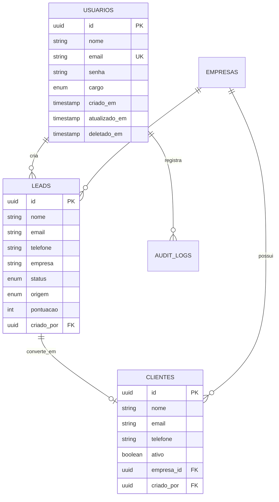

# Arquitetura do CRM Público

## Visão Geral

O CRM Público é uma aplicação full-stack dividida em duas partes principais:

```
┌─────────────────────────────────────────────────────────────┐
│                        FRONTEND                              │
│  Next.js 16 + React 19 + Tailwind CSS + Framer Motion      │
│              (Server-Side Rendering + CSR)                   │
└──────────────────────┬──────────────────────────────────────┘
                       │ HTTPS/REST API
                       │ JWT Auth
┌──────────────────────▼──────────────────────────────────────┐
│                        BACKEND                               │
│     NestJS 11 + TypeORM + Express + Node.js 18+            │
└───────────┬─────────────────┬────────────────┬──────────────┘
            │                 │                │
            ▼                 ▼                ▼
    ┌──────────────┐  ┌─────────────┐  ┌──────────────┐
    │ PostgreSQL16 │  │   Redis 7   │  │   Sentry     │
    │   (Primary)  │  │   (Cache)   │  │(Monitoring)  │
    └──────────────┘  └─────────────┘  └──────────────┘
```

## Arquitetura Backend

### Camadas da Aplicação

```
┌─────────────────────────────────────────────────┐
│              Controllers                        │
│  (HTTP Handlers, DTOs, Validation)             │
└──────────────────┬──────────────────────────────┘
                   │
┌──────────────────▼──────────────────────────────┐
│              Services                           │
│  (Business Logic, Use Cases)                   │
└──────────────────┬──────────────────────────────┘
                   │
┌──────────────────▼──────────────────────────────┐
│           Repositories                          │
│  (Data Access Layer, TypeORM)                  │
└──────────────────┬──────────────────────────────┘
                   │
┌──────────────────▼──────────────────────────────┐
│              Entities                           │
│  (Database Models, Relations)                  │
└─────────────────────────────────────────────────┘
```

### Módulos Principais

#### 1. Auth Module
```typescript
auth/
├── strategies/
│   └── jwt.strategy.ts
├── guards/
│   ├── jwt-auth.guard.ts
│   └── roles.guard.ts
├── decorators/
│   └── roles.decorator.ts
├── dto/
│   ├── login.dto.ts
│   └── register.dto.ts
├── auth.controller.ts
├── auth.service.ts
└── auth.module.ts
```

**Responsabilidades:**
- Autenticação com JWT
- Refresh tokens
- Validação de credenciais
- RBAC (Role-Based Access Control)

#### 2. Users Module
```typescript
users/
├── entities/
│   └── user.entity.ts
├── dto/
│   ├── create-user.dto.ts
│   └── update-user.dto.ts
├── users.controller.ts
├── users.service.ts
└── users.module.ts
```

#### 3. Leads Module
Mesma estrutura, com lógica específica para leads.

#### 4. Dashboard Module
```typescript
dashboard/
├── dto/
│   └── dashboard.dto.ts
├── dashboard.controller.ts
├── dashboard.service.ts
└── dashboard.module.ts
```

**Features Especiais:**
- Materialized Views PostgreSQL
- Cache Redis (TTL 15min)
- Queries otimizadas
- Agregações complexas

#### 5. Search Module
```typescript
search/
├── search.controller.ts
├── search.service.ts
└── search.module.ts
```

**Implementação:**
- Full-Text Search PostgreSQL
- Índices GIN
- Ranking por relevância
- Fallback para ILIKE

### Interceptors e Middleware

```
Request Flow:

Client Request
    │
    ▼
[Request ID Interceptor]  ← Gera X-Request-Id
    │
    ▼
[Logging Interceptor]     ← Log de entrada
    │
    ▼
[Auth Guard]              ← Valida JWT
    │
    ▼
[Roles Guard]             ← Verifica permissões
    │
    ▼
[Controller]              ← Executa handler
    │
    ▼
[Service]                 ← Lógica de negócio
    │
    ▼
[Repository]              ← Acesso ao banco
    │
    ▼
[Response Wrapper]        ← {success, data, timestamp}
    │
    ▼
[Logging Interceptor]     ← Log de saída
    │
    ▼
[Sentry Interceptor]      ← Captura erros 5xx
    │
    ▼
[Metrics Interceptor]     ← Prometheus metrics
    │
    ▼
Client Response
```

### Cache Strategy

```typescript
// Cache em camadas
L1: In-Memory (NestJS Cache)
    └─ TTL: 1min
    └─ Usado em: operações muito frequentes

L2: Redis
    └─ TTL: 15min (dashboard), 5min (search)
    └─ Usado em: dados computacionalmente caros
```

**Cache Keys:**
```
dashboard:v1:stats:period=month
search:v1:query=joao:page=1:limit=10
```

### Database Design

#### Entidades Principais



#### Materialized View (Dashboard)

```sql
CREATE MATERIALIZED VIEW mv_dashboard_stats AS
SELECT
    COUNT(DISTINCT leads.id) as total_leads,
    COUNT(DISTINCT clientes.id) as total_clientes,
    COUNT(DISTINCT empresas.id) as total_empresas,
    ROUND(
        (COUNT(DISTINCT clientes.id)::numeric /
         NULLIF(COUNT(DISTINCT leads.id), 0) * 100),
        2
    ) as taxa_conversao
FROM leads
LEFT JOIN clientes ON clientes.lead_id = leads.id
LEFT JOIN empresas ON empresas.id = clientes.empresa_id;

-- Refresh automático a cada 15 minutos (via cron job)
```

## Arquitetura Frontend

### Estrutura de Diretórios

```
frontend/
├── app/
│   ├── (auth)/
│   │   ├── login/
│   │   └── register/
│   ├── (dashboard)/
│   │   ├── dashboard/
│   │   ├── leads/
│   │   ├── clientes/
│   │   └── [...outros módulos]
│   ├── page.tsx          # Splash screen
│   └── layout.tsx
├── components/
│   ├── layout/
│   │   ├── Sidebar.tsx
│   │   └── Header.tsx
│   └── ui/
│       └── [...componentes reutilizáveis]
├── contexts/
│   └── AuthContext.tsx
├── hooks/
│   ├── useDashboard.ts
│   └── useAuth.ts
├── lib/
│   ├── api.ts            # Axios instance
│   └── utils.ts
└── types/
    └── index.ts
```

### Fluxo de Autenticação

```
┌─────────────────────────────────────────────────┐
│         1. User abre aplicação                  │
│            http://localhost:3002/               │
└──────────────────┬──────────────────────────────┘
                   │
                   ▼
          ┌─────────────────┐
          │  Splash Screen  │
          │   (app/page)    │
          └────────┬────────┘
                   │
        ┌──────────▼──────────┐
        │ AuthContext check   │
        └──────────┬──────────┘
                   │
         ┌─────────▼─────────┐
         │ Token válido?     │
         └─────────┬─────────┘
                   │
        ┌──────────┴──────────┐
        │                     │
    ❌ Não                 ✅ Sim
        │                     │
        ▼                     ▼
   /login                /dashboard
        │                     │
        ▼                     │
  [Login Form]                │
        │                     │
   POST /auth/login           │
        │                     │
        ▼                     │
  Save tokens                 │
   localStorage                │
        │                     │
        └─────────┬───────────┘
                  │
                  ▼
           Protected Routes
```

### API Integration

```typescript
// lib/api.ts

// Request Interceptor
api.interceptors.request.use((config) => {
  const token = localStorage.getItem('access_token');
  if (token) {
    config.headers.Authorization = `Bearer ${token}`;
  }
  return config;
});

// Response Interceptor (Auto unwrap + Refresh)
api.interceptors.response.use(
  (response) => {
    // Unwrap {success, data} → data
    return { ...response, data: response.data.data };
  },
  async (error) => {
    if (error.response?.status === 401) {
      // Try refresh token
      const refreshToken = localStorage.getItem('refresh_token');
      if (refreshToken) {
        const { data } = await axios.post('/auth/refresh', {
          refresh_token: refreshToken
        });
        localStorage.setItem('access_token', data.access_token);
        // Retry original request
        return api(error.config);
      }
    }
    return Promise.reject(error);
  }
);
```

### Performance Otimizações

#### Backend
- ✅ Redis caching (70-80% redução)
- ✅ Materialized Views
- ✅ Connection pooling
- ✅ Índices otimizados
- ✅ Lazy loading de relações

#### Frontend
- ✅ Code splitting (Next.js automático)
- ✅ Image optimization
- ✅ SSR para SEO
- ✅ Prefetch de rotas
- ✅ Debounce em buscas

## Observabilidade

### Logging

```typescript
// Winston structured logs
{
  level: 'info',
  message: 'User login successful',
  timestamp: '2025-02-10T...',
  context: 'AuthService',
  userId: '123',
  email: 'user@example.com',
  requestId: 'abc-123'
}
```

### Metrics (Prometheus)

```
# Request counter
http_requests_total{method="GET",route="/api/v1/leads",status="200"} 1234

# Latency histogram
http_request_duration_seconds_bucket{method="GET",route="/api/v1/dashboard"} 0.005
```

### Error Tracking (Sentry)

- Captura automática de erros 5xx
- Breadcrumbs para rastreamento
- Source maps para stack traces
- User context em cada evento

## Segurança

### Em Repouso
- Senhas: Bcrypt (10 rounds)
- Tokens: JWT (HS256)
- Dados sensíveis: Sanitizados em logs

### Em Trânsito
- HTTPS obrigatório em produção
- CORS restritivo
- Helmet.js headers

### Runtime
- Guards em todas rotas
- Validação de DTOs
- Rate limiting
- SQL injection protection (TypeORM)

## Deployment

### Docker Compose

```yaml
services:
  postgres:
    image: postgres:16
    ports: ["5433:5432"]

  redis:
    image: redis:7
    ports: ["6379:6379"]

  backend:
    build: ./backend
    ports: ["3000:3000"]
    depends_on: [postgres, redis]

  frontend:
    build: ./frontend
    ports: ["3002:3000"]
    depends_on: [backend]
```

### CI/CD Pipeline

```
git push → GitHub Actions
    │
    ├─ Lint & TypeScript check
    ├─ Unit tests (300 testes)
    ├─ E2E tests (23 testes)
    ├─ Build
    ├─ Docker build
    └─ Deploy (se main branch)
```

## Escalabilidade

### Horizontal Scaling

```
Load Balancer
    ├─ Backend Instance 1
    ├─ Backend Instance 2
    └─ Backend Instance 3
         │
         ├─ Shared Redis
         └─ Shared PostgreSQL
```

### Vertical Scaling

- PostgreSQL: Aumentar resources
- Redis: Aumentar memória
- Backend: Aumentar CPU/RAM

## Próximos Passos

- [ ] WebSockets para real-time
- [ ] GraphQL API
- [ ] Multi-tenancy
- [ ] Message Queue (RabbitMQ/Bull)
- [ ] Elasticsearch para busca avançada
- [ ] Microservices architecture

---

**Última atualização:** 2025-02-10
